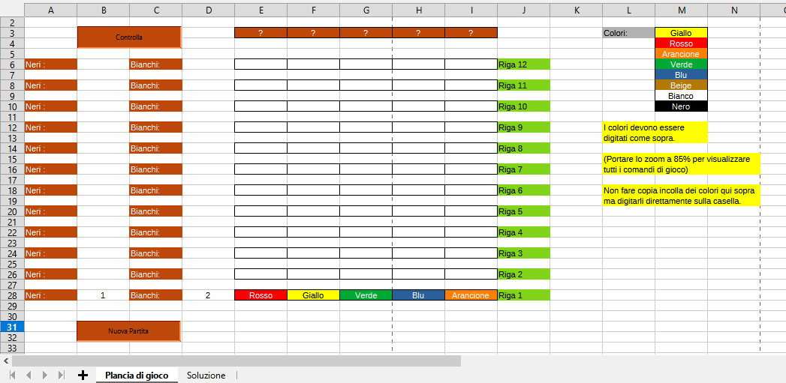

# Super-Master-Mind-Excel
This is a simulator of the well-known game Super Master Mind, the rules are exactly those of the game in box, only that you play alone and there is no exchange of roles of the two players. For the rules go [here](https://brainking.com/it/GameRules?tp=102).

  

# Installation
* You must have LibreOffice installed, if you don’t have it go [here](https://it.libreoffice.org/download/download/)
* Clone this repository
* If you haven’t already done the basic macro execution skills in LibreOffice, do as follows:
  * Open LibreOffice calc
  * Follow the path `tools>options>security>macro security` and set the value "average"
* Open the file `.ods` (the file `.bas` in the repository is not linked to the spreadsheet, it is only a copy of the code contained within the project, so you can move it somewhere else without problem)
# Play
Because you should know the rules, the game board is the digital version of the one in the box, only that here to insert the colored "pegs" to guess the hidden code you simply have to type the name of the color in the corresponding box (on the right there is a demonstration of how strictly they must be written in order for the code to work).
Once you have transcribed your attempt, just click "controlla" in the upper left corner and you will see the responses of your attempt (those that in the real game are the black and white pegs) and continue until you guess the hidden code, then you will win the game and the line where there are question marks will be replaced with the solution. 
If you use all the lines and do not discover the code you will get the message of defeat but you will also see here the solution.
